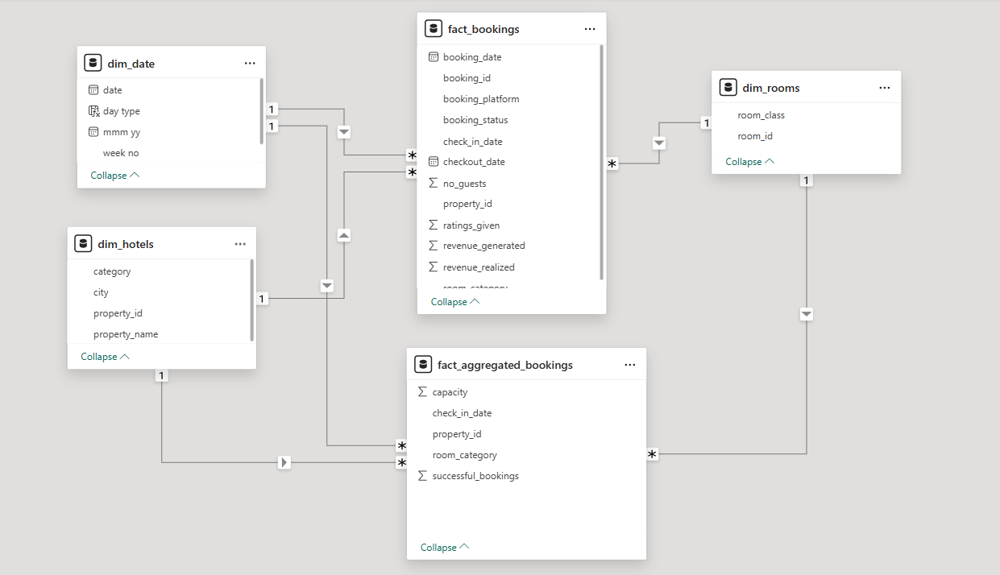

# 🏨 AtliQ Hospitality Analysis – Power BI

## 📌 Problem Statement  
AtliQ Grands owns multiple five-star hotels across India and has been a leader in the hospitality industry for over 20 years. However, due to strategic moves by competitors and ineffective decision-making, the company has recently been losing market share and revenue in the luxury/business hotels category.

To address this challenge, the Managing Director decided to incorporate **Business and Data Intelligence** to make data-driven decisions and regain market share. Since AtliQ Grands lacks an in-house analytics team, they hired a third-party data analytics service (our role) to derive insights from their historical data. :contentReference[oaicite:0]{index=0}

---

## 🎯 Objective  
As a Data Analyst, my goal was to:  
- Build meaningful **KPIs and metrics** as per the requirements.  
- Design and develop an interactive **Power BI dashboard** based on the provided mock-up.  
- Generate **data-driven insights** that can help improve decision-making and business strategies.

---

## 🧾 Task List

1. **Create Metrics**  
   - Develop the required KPIs as per the metric list provided.  
   - Ensure accuracy and consistency in all calculations.  

2. **Design Dashboard**  
   - Recreate the provided **mock-up dashboard** using Power BI.  
   - Focus on clarity, interactivity, and user-friendly visuals.

3. **Generate Insights**  
   - Identify and highlight additional insights not included in the mock-up or metric list.  
   - Provide business recommendations based on data trends.

---

## 🖼️ 1. Provided Mock-up Dashboard  
*(Sample mock-up provided by stakeholders for reference)*

---

## 🧩 2. Data Model  
The Power BI **data model** was built using star schema principles, ensuring optimized relationships and efficient data retrieval.

**Tables Used:**  
- `dim_date`  
- `dim_hotels`  
- `dim_rooms`  
- `dim_customers`  
- `fact_bookings`  
- `fact_revenue`

**Model Highlights:**  
- Proper relationships defined using primary and foreign keys.  
- Calendar table created for dynamic time intelligence.  
- Data cleaned and transformed in Power Query before loading.

---

## 📊 3. Overall Analysis View  
The **Overall Analysis Dashboard** provides a high-level overview of the company’s performance, featuring:  
- Total Revenue  
- Total Bookings  
- Average Rating  
- Occupancy Rate  
- RevPAR (Revenue Per Available Room)

---

## 📅 4. Monthly View  
The **Monthly View Dashboard** enables management to track trends over time, including:  
- Month-over-month revenue growth  
- Occupancy rate fluctuations  
- Customer satisfaction ratings  
- Top-performing cities and hotels  

---

## 💡 Key Insights  
- 📈 **Revenue & Occupancy Correlation:** Cities with higher occupancy rates showed significantly better revenue performance.  
- 🏙️ **Top Performers:** Hotel properties such as AtliQ Exotica and AtliQ Bay out-performed others in both revenue and customer satisfaction. :contentReference[oaicite:1]{index=1}  
- 📉 **Underperforming Properties:** Some locations had consistently low occupancy — these are potential targets for marketing or operational optimisation.  
- 💰 **Seasonal Trends:** Strong revenue spikes were observed during holiday/seasons, suggesting opportunities for targeted promotions.  
- ⭐ **Customer Experience Impact:** Hotels with higher customer ratings saw higher repeat booking rates, highlighting the importance of service quality.

---

## 📘 What I Learned  
This project helped me strengthen my skills in:  
- Power BI dashboard design and data storytelling.  
- Data modeling and DAX formula creation.  
- Performing data cleaning and transformation using Power Query.  
- Understanding business KPIs in the hospitality domain.  
- Creating actionable insights for strategic business decisions.

---

## 🛠️ Tools & Technologies  
- **Power BI Desktop**  
- **Excel / CSV Data Sources**  
- **Power Query (Data Cleaning & Transformation)**  
- **DAX (Data Analysis Expressions)**

---

---

## 🏁 Conclusion  
The analysis provided AtliQ Grands with a data-driven approach to improve decision-making, identify performance bottlenecks, and strategize better for market recovery. This project demonstrates the power of **Business Intelligence** in transforming raw data into actionable business insights.

---

👨‍💻 **Developed by:** [Trijesh Kondapuram](https://github.com/trijesh61)  
📅 **Domain:** Hospitality Analytics | **Tool:** Power BI

